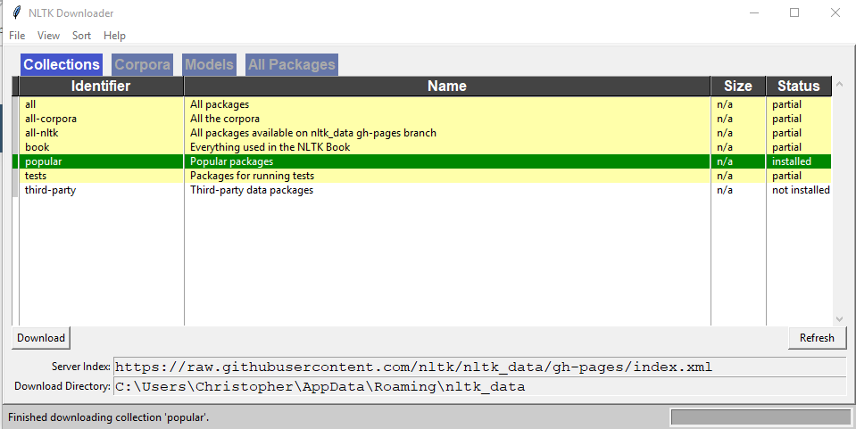

# nltk_demo
Experiments with NLTK and python.

## Setup

Make sure you have Python 3 installed.
Either follow the instructions on the NLTK website or download the Latest Pythong 3 installer.

I created a requirements.txt file to manage the list of packages needed.


To setup you run.

```cmd
pip install -r requirements.txt
```

Then you want to run the download script like this.

```cmd
python download.py
```

it will show a dialog like this.



I just downloaded the popular dataset.

## Links

+ [requirements.txt](https://pip.pypa.io/en/stable/user_guide/#id1)
+ [NLTK](https://www.nltk.org/)
+ [Tutorial](https://towardsdatascience.com/gentle-start-to-natural-language-processing-using-python-6e46c07addf3)
